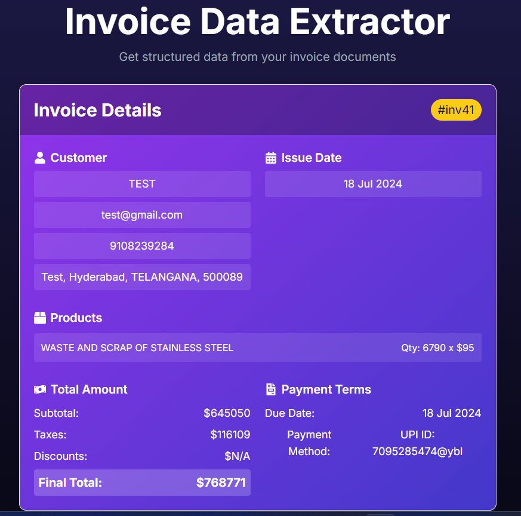

# InvoiceExtractor

## Demo-URL
```
https://invoice-extractor-blush.vercel.app/
```

## Overview
InvoiceExtractor is a sophisticated tool that automates the extraction of critical information from invoice PDFs. It uses OpenAI's GPT Large Language Model to parse text efficiently and accurately, facilitating seamless data handling. This project leverages Next.js for its front-end, employing SSR techniques to enhance performance and SEO, while the back-end runs on Node.js with Firebase as the database solution. The generative UI is powered by AI SDKs, ensuring a dynamic and interactive user experience. Deployed on Vercel, this tool provides a robust and scalable solution for businesses needing automated invoice data extraction.

## Features
- **Data Extraction**: Automatically extracts customer details, product information, and total amounts from invoices.
- **Generative UI**: Uses AI-driven SDKs to create a responsive and adaptive user interface.
- **LLM Integration**: Incorporates OpenAI's GPT model to interpret and structure raw invoice data.
- **Real-Time Data Handling**: Streams data effectively using modern AI SDKs.
- **Server-Side Rendering**: Implemented using Next.js to improve load times and search engine visibility.
- **Database Management**: Stores and manages data securely with Firebase.
- **Scalable Deployment**: Hosted on Vercel for optimal performance and scalability.

## Technologies Used
- **Next.js**: For building a scalable front-end with server-side rendering.
- **Node.js**: Provides the runtime environment for server logic.
- **Firebase**: Acts as the backend database to store structured data.
- **OpenAI GPT**: Used for parsing and extracting information from text.
- **AI SDKs**: Enhance UI with dynamic, generative components.
- **Vercel**: For deployment, ensuring high availability and performance.


## Backend Functionality

### Data Extraction with Node.js
- **Node.js** serves as the backbone for backend operations in InvoiceExtractor, efficiently managing the extraction of data from invoice PDFs. The backend leverages various libraries to read PDF files and integrates OpenAI's GPT model to accurately interpret and structure the invoice data.

### Uploading Invoices to Firebase
- After data extraction, the structured invoice data is uploaded to **Firebase**, providing a secure and scalable cloud storage solution. This allows for easy management and retrieval of invoice records, supporting robust data handling capabilities for businesses.

### Real-Time Data Streaming with AI SDKs
- Utilizing modern **AI SDKs**, InvoiceExtractor enhances its data processing capabilities by streaming extracted data in real time. This feature is particularly beneficial within the dynamic environment of a **Next.js** application, ensuring that users experience minimal latency and receive updates as they occur.

### Integration in Next.js Application
- The backend functionalities seamlessly integrate within the **Next.js** framework, utilizing API routes to handle requests for data extraction, storage, and streaming. This integration supports server-side rendering (SSR) techniques to improve the performance, SEO, and overall user experience of the InvoiceExtractor tool.


## Installation

To get started with InvoiceExtractor:

1. Clone the repository:
   ```
   git clone https://github.com/yourusername/InvoiceExtractor.git
   ```
2. Install dependencies:
   ```
   cd InvoiceExtractor
   npm install
   ```
3. Set up your environment variables in a `.env.local` file:
   ```
   OPENAI_API_KEY=xxxxxxxxxxxxxxxxxx
   ```
4. Run the development server:
   ```
   npm run dev
   ```
   Visit `http://localhost:3000` to view the app.

## Deployment
Deploying on Vercel:
- Push your changes to your repository.
- Connect your GitHub repository to Vercel.
- Follow Vercel’s deployment steps to deploy your application.

## Contributing
Contributions are welcome! Please fork the repository and submit pull requests with your proposed changes.

## demo images
